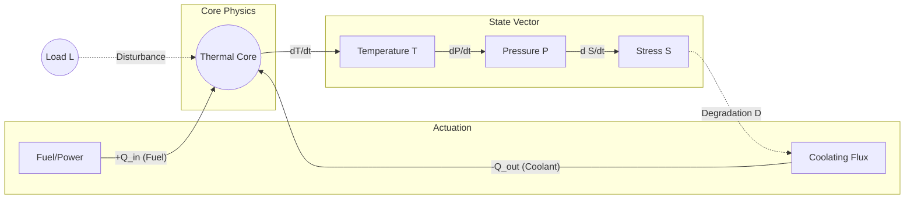

# 🏭 Thermal Plant Control Environment (OpenEnv)

[](https://github.com/meta-pytorch/OpenEnv)
[](https://www.python.org/downloads/)
[](https://opensource.org/licenses/Apache-2.0)
[](https://huggingface.co/spaces/kaushalrajpuwar/thermal-plant-control)

> **Evaluating LLM Reasoning in Safety-Critical Cyber-Physical Systems.**

---

## 📖 Overview

The **Thermal Plant Control Environment** is a high-fidelity, deterministic simulation designed to test the limits of agentic reasoning in industrial automation. Agents must manage a simulated power plant, balancing energy production (**Power Output**) against strict physical constraints (**Temperature**, **Pressure**, and **Mechanical Stress**) under the influence of delayed actuator responses and long-term hardware degradation.

This environment is fully compliant with the **Meta PyTorch OpenEnv** specification and serves as a benchmark for evaluating LLMs on multi-step optimization, disturbance rejection, and preemptive safety management.

This environment is fully compliant with the **Meta PyTorch OpenEnv** specification and serves as a benchmark for evaluating LLMs on multi-step optimization, disturbance rejection, and preemptive safety management.

### 🧩 Benchmark Sensitivity & Precision
Unlike discrete logic puzzles, this environment measures **Control Resolution**. 
- **Thermal Inertia:** Heat doesn't dissipate instantly; models must "cool ahead" to prevent spikes.
- **Actuator Lag:** Inputs are smoothed by a 0.5-alpha delay. Reactive models will oscillate; reasoning models will anticipate.
- **Coupled Variables:** Changing fuel input affects temperature AND pressure simultaneously, requiring multi-variable optimization.

---

## 🛠️ System Dynamics

### 🧪 Plant Schematic (Topology)
The system is modeled as a **2nd-order coupled thermal-hydraulic loop**. Energy balance ($\dot{Q}_{net} = \alpha U - \beta F$) drives the core temperature ($T$), which induces non-linear pressure transients ($P$) and cumulative hardware stress ($S$).



### 🔍 Observation Space

| Variable | Symbol | Description | Safety Limit |
| :--- | :--- | :--- | :--- |
| **Power Output** | `P` | Current electrical generation tracking the required load. | N/A |
| **Required Load** | `L` | Dynamic target for power production. | N/A |
| **Temperature** | `T` | Thermal state. Crossing **1.0** triggers safety penalties. | < 1.0 |
| **Pressure** | `Pr` | Internal vessel pressure. Crossing **1.0** triggers penalties. | < 1.0 |
| **System Stress** | `S` | Instantaneous mechanical strain from heat/pressure. | < 1.3 |
| **Degradation** | `D` | Cumulative wear. Reduces cooling efficiency by up to 60%. | N/A |
| **Control Valve** | `U` | Actual position of the fuel/power actuator (with inertia). | [0, 1] |
| **Cooling Valve** | `F` | Actual position of the coolant actuator (with inertia). | [0, 1] |

### ⚡ Action Space

The agent must output a JSON object containing exactly two continuous values `[0.0, 1.0]`:

```json
{
  "U_target": 0.65,
  "F_target": 0.45
}
```

> [!NOTE]
> **Actuator Inertia:** The system implements a 0.5 alpha smoothing. Your target input does not jump the valve instantly; the system exponentially approaches your target over multiple steps. Anticipation is key.

---

## 🏆 Standalone Benchmark Tasks

The challenge scales through four distinct operational regimes. Every task is deterministic and reproducible.

### 🟢 Task 1: Stable Baseline Operation
Establishes the agent's ability to maintain equilibrium in a "Cold-Start" or "Steady-State" regime.
| Operational Profile | Objective | Critical Observation |
| :--- | :--- | :--- |
| **Static Demand** | Maintain zero-error tracking. | Stability of Power output `P`. |
| **Zero Disturbance** | Verify actuator lag compensation. | Valve position `U` vs `L`. |

### 🟡 Task 2: Load Following
Simulates a grid-level demand spike requiring rapid power scaling.
| Operational Profile | Objective | Critical Observation |
| :--- | :--- | :--- |
| **Instant Step-Change** | Transition power output to new setpoints. | Overshoot (`OS`) management. |
| **Dynamic Scaling** | Minimize settling time during transients. | Tracking Error (`TE`) recovery. |

### 🟠 Task 3: Preemptive Constraint Management
A high-pressure scenario where the agent spawns into a system near its thermal limit.
| Operational Profile | Objective | Critical Observation |
| :--- | :--- | :--- |
| **Near-Critical Spawn** | Immediate heat mitigation (Emergency Cooling). | Temperature `T` safety buffer. |
| **Boundary Control** | Prevent stress leakage at high pressures. | Stress accumulation `S`. |

### 🔴 Task 4: Fault Recovery with Degradation
The ultimate stress test. Simultaneous hardware failure and external thermal shock.
| Operational Profile | Objective | Critical Observation |
| :--- | :--- | :--- |
| **Athermal Shock** | Recover from sudden energy injection. | Pressure rate-of-change. |
| **Hardware Wear** | Manage degraded coolant efficiency (D=0.6). | Valve saturation limits. |

---

## 📊 Performance & Discriminative Power

We compare high-frontier models against a hardcoded **Rule-Based Baseline** to measure the reasoning "delta." 

| Task ID | **Heuristic Baseline** | **Llama-3.3-70B** | Improvement |
| :--- | :---: | :---: | :---: |
| `task1` | 0.95 | **0.95** | --- |
| `task2` | 0.77 | **0.84** | **+9%** |
| `task3` | 0.57 | **0.75** | **+31%** |
| `task4` | 0.48 | **0.74** | **+54%** |

> [!TIP]
> **The Success Reversal:** Note that while rule-based logic is sufficient for steady-state tracking (Task 1), it lacks the 'Predictive Intuition' required for high-stress recovery. The **9%-54% improvement** of the LLM over the baseline validates this repository as a true test of **Physical Reasoning** rather than simple instruction following.

**Observation:** While standard rules (If/Then) can solve Task 1 and 2, they fail catastrophically in Tasks 3 and 4 once physics delays and non-linear shocks are introduced. The Llama-3.3-70B model demonstrates **superior recovery logic**, identifying the need for "Maximum Cooling" well before the baseline script reacts.

> [!IMPORTANT]
> **Anti-Coasting Fix:** We have strictly defined the evaluation window to begin **ONLY after** the disturbance injection. Models can no longer inflate their scores with early "stable" steps.

---

## 🚀 Getting Started

### 1️⃣ Installation

Clone the repository and install the lightweight requirements:

```bash
git clone https://huggingface.co/spaces/kaushalrajpuwar/thermal-plant-control
cd thermal-plant-control
pip install -r requirements.txt
```

### 2️⃣ Environment Configuration

Create a `.env` file or export your tokens:

```bash
export HF_TOKEN="your_token_here"
export MODEL_NAME="meta-llama/Llama-3.3-70B-Instruct"
export API_BASE_URL="https://router.huggingface.co/v1"
```

### 3️⃣ Running Inference

Execute the full 4-task sequential evaluation:

```bash
python inference.py
```

### 4️⃣ Local Docker Validation

To mirror the Exact Hugging Face production environment locally:

```bash
docker build -t thermal-plant:latest .
docker run -p 7860:7860 thermal-plant:latest
```

---

## 🤝 The Team

*   [**KaushalrajPuwar**](https://github.com/KaushalrajPuwar)
*   [**freakun0025**](https://github.com/freakun0025)
*   [**nikunj169**](https://github.com/nikunj169)

---

> [!TIP]
> **Check the Graders:** View the deterministic grading formulas in `graders/_metrics.py` to understand exactly how TE (Tracking Error), SV (Safety Violation), OC (Oscillation), and all other internal metrics impact your final leaderboard standing.
